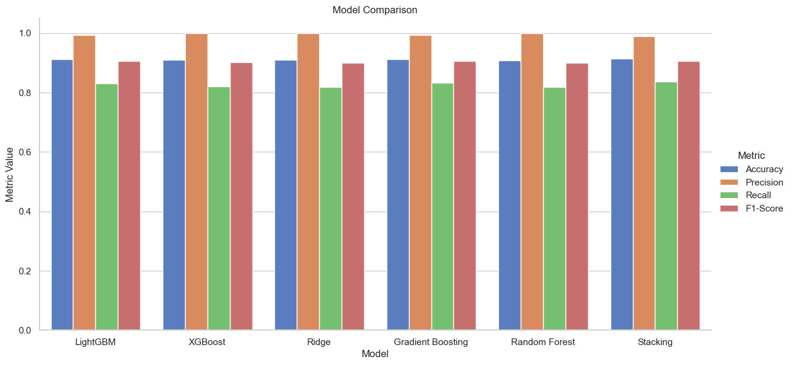
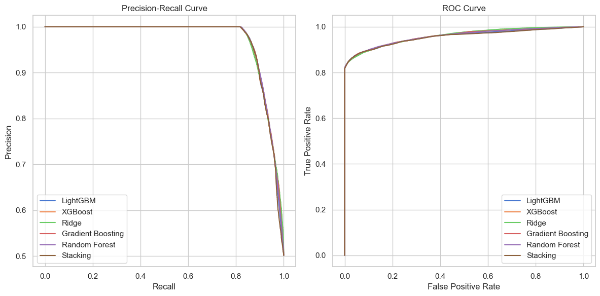

# Bigdata team project 'Drug Use prediction'


Team project on the subject “Architecture and Technologies of Big Data Systems” at the [National Technical University of Ukraine “Igor Sikorsky Kyiv Polytechnic Institute”](https://kpi.ua/en/).  

The goal of the project is to build a prediction model that will determine whether a person uses drugs (such as cocaine, crack, or marijuana)  

The dataset used for training was the National Survey of Drug Use and Health (2015-2019)

## Models used:
1. `LGBMRegressor`: Uses gradient boosting based on LightGBM
2. `XGBRegressor`: Uses gradient boosting based on XGBoost
3. `Ridge Regressor`: Linear regression with regularization using Ridge
4. `Gradient Boosting Regressor`: Uses gradient boosting to improve model accuracy
5. `Random Forest Regressor`: Uses an ensemble of decision trees for prediction
6. `StackingCVRegressor`: A model that combines the predictions of several underlying models using cross-validation

## Repository contents
- `data/`: The folder with the preprocessed datasets
- `doc/`: Іnformation about the dataset is taken from [SAMHSA site](https://www.samhsa.gov/data/data-we-collect/nsduh/datafiles?data_collection=1153&year=2002)
- `demo/`: Images with the results of model testing
- `models/`: Saved models and pipeline
- `notebooks/`: A Jupyter notebook for data visualization, models training, and analysis of results
- `requirements.txt`: List of required Python packages for installation

## Results
| Model             | Accuracy | Precision | Recall   | F1-Score |
|-------------------|----------|-----------|----------|----------|
| LightGBM          | 0.912226 | 0.992937  | 0.830966 | 0.904760 |
| XGBoost           | 0.909194 | 0.999785  | 0.819188 | 0.900521 |
| Ridge Regression  | 0.909039 | 0.999677  | 0.818968 | 0.900344 |
| Gradient Boosting | 0.912580 | 0.992683  | 0.831892 | 0.905203 |
| Random Forest     | 0.908441 | 1.000000  | 0.817512 | 0.899595 |
| Stacking          | 0.913221 | 0.989709  | 0.835730 | 0.906225 |





## Installation and use
#### Clone the repository:
```sh
git clone https://github.com/TokenRR/Bigdata_university_course.git
```
   
```sh
cd Bigdata_university_course
```

#### Install the required packages:
```sh
pip install -r requirements.txt
```

---
You can use the notebooks from the `notebooks/` folder to research and analyze the results.  
If you would like to contribute to this project, please create a **pull request** or open a new **issue**
